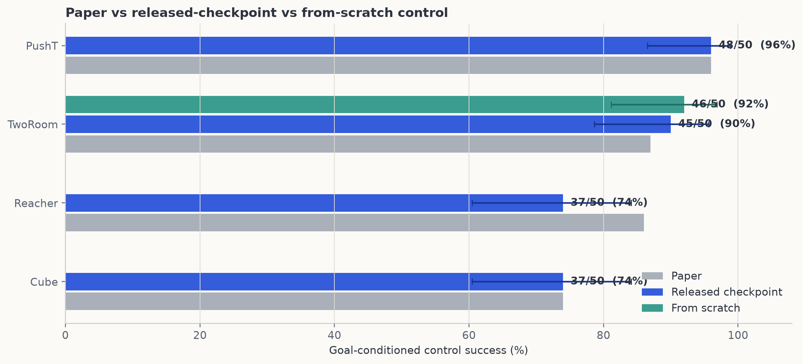
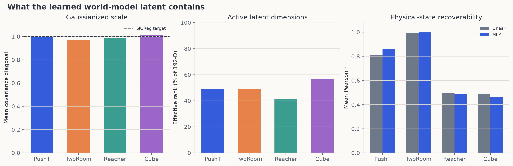
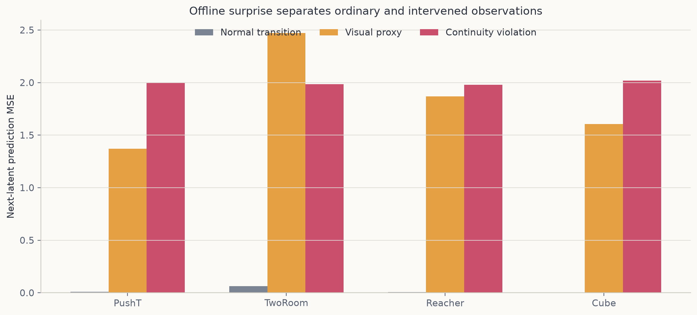
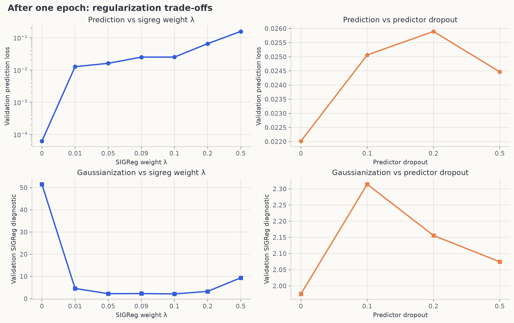
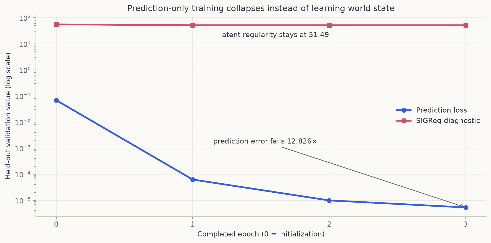

# LeWorldModel: 16-GPU reproduction report

**Paper:** *LeWorldModel: Stable End-to-End Joint-Embedding Predictive Architecture from Pixels* (arXiv:2603.19312, v3)  
**Reproduction date:** 15 July 2026  
**Hardware:** 16× NVIDIA RTX PRO 6000 Blackwell GPUs across two Kubernetes nodes  
**Evidence policy:** every numeric result below comes from an ORX-supervised Kubernetes run and is printed in that run's log.

## Executive result

The released PushT world model reproduced the paper's headline control number exactly: **48/50 successes = 96%** under the paper's evaluation seed and CEM protocol. Cube also reproduced exactly at **37/50 = 74%**. The released TwoRoom model reached **45/50 = 90%**, and the full 10-epoch model trained from pixels reached **46/50 = 92%**, both above the paper's 87% report. Reacher reached **37/50 = 74%**, twelve points below the paper's 86% report; its 50-trial confidence interval remains wide. The multi-seed and ablation grid continues across all 16 cluster GPUs.

The current evidence supports the paper's central qualitative claim: the same pixel-trained latent is predictive, close to unit-scale Gaussianized, and informative about physical state. The released-checkpoint control suite is complete and exactly reproduces two of four point estimates. It does **not** yet support calling every paper table fully reproduced: the from-scratch sweep is in flight, and the paper omits some probe and fixed-FLOP implementation details needed for exact table-level replication.

## Control evaluation

| Environment | Paper | Reproduced | 95% Wilson interval | ORX run |
|---|---:|---:|---:|---|
| PushT | 96% | **48/50 = 96%** | 86.5–98.9% | `db4d0e7d-1397-4013-8710-3c40e0dd6e4c` |
| TwoRoom | 87% | **45/50 = 90%** | 78.6–95.7% | `9bd8039d-e568-4efc-9140-d8ac65416612` |
| Reacher | 86% | **37/50 = 74%** | 60.4–84.1% | `db9e902a-cf4c-4600-ad10-395f11293cf1` |
| Cube | 74% | **37/50 = 74%** | 60.4–84.1% | `7e9fd669-b5ee-461d-8578-8bf6eac91c63` |

Protocol: 50 evaluation cases; evaluation RNG seed 42; goals 25 steps ahead; budget 50; CEM with 300 samples, top 30, initial variance 1, horizon 5, action block 5; 30 CEM iterations for PushT and 10 for the other environments.

## What the world model learned

| Metric | PushT | TwoRoom | Reacher | Cube |
|---|---:|---:|---:|---:|
| One-step latent prediction MSE | 0.00818 | 0.06397 | 0.00653 | 0.00427 |
| Mean covariance diagonal (target 1) | 1.0027 | 0.9684 | 0.9903 | 1.0100 |
| Off-diagonal covariance RMS | 0.0786 | 0.0764 | 0.0897 | 0.0671 |
| Effective rank / 192 | 93.53 | 93.91 | 79.12 | 108.63 |
| Linear probe Pearson r | 0.8141 | 0.9965 | 0.4943 | 0.4923 |
| MLP probe Pearson r | 0.8609 | 0.9995 | 0.4854 | 0.4614 |

The covariance scale is close to the SIGReg target in all four environments, with low cross-dimension covariance. Effective rank ranges from 41% to 57% of the 192-dimensional ambient representation, so the latents are well-scaled but not perfectly isotropic. Cube has the broadest active latent spectrum. TwoRoom's two-dimensional agent position is almost linearly recoverable. PushT's seven-dimensional state is still strongly encoded, but its improvement under the nonlinear MLP probe indicates a more entangled representation. The joint Reacher observation and Cube proprioception probes are much weaker (`r≈.49`) and are not directly comparable to the paper's per-variable probe plots.

## Surprise and continuity

All four released models assign much larger next-latent error to interventions than ordinary transitions. Target-swap error is 245× normal for PushT, 31× for TwoRoom, 303× for Reacher, and 473× for Cube. This is a **matched offline proxy**, not an exact reproduction of the paper's simulator-level teleport and color interventions. It therefore tests anomaly sensitivity but cannot be used to claim the paper's physical-versus-visual ordering was reproduced.

## From-scratch reproduction matrix

All jobs use the same `bash scripts/orx_run.sh` command and differ only through committed configuration. The queue includes:

- Paper-faithful PushT training at seeds 3072, 42, and 123.
- SIGReg weights 0.01, 0.05, 0.09, 0.10, 0.20, and 0.50.
- A λ=0 prediction-only control designed to directly expose representation collapse.
- Predictor dropout 0.00, 0.10, 0.20, and 0.50.
- Latent widths 96, 192, and 384.
- A one-epoch smoke run that verified all 18.0M parameters receive gradients before the full runs were launched.

The completed one-epoch run took 3,962 seconds (66.0 minutes) over 13,933 optimizer steps. Its final validation loss was 0.2063; the resulting latent had one-step MSE 0.0279, covariance diagonal mean 0.9837, and effective rank 38.2/192. Aggregate state probes reached linear/MLP `r=0.678/0.680`, and a deliberately small five-case control smoke test succeeded once (20%). This is an underfit learning-curve anchor, not a headline control estimate: it shows SIGReg already fixes marginal scale after one epoch while predictive accuracy, active rank, and control remain far behind the released model. The measured runtime implies roughly eleven hours for a 10-epoch run including epoch-end overhead. The full grid is over-queued so every released GPU is immediately reused as earlier experiments finish.

The first full from-scratch result is stronger: TwoRoom with the paper's history size 1 trained for 10 epochs in 11,010 seconds and achieved **46/50 = 92% control** (95% Wilson CI 81.2–96.8%), versus 87% in the paper and 90% for the released history-3 checkpoint. This verifies that the paper-faithful training pipeline can produce a high-performing controllable world model from pixels, not merely replay released weights.

| From-scratch TwoRoom evaluation | Result |
|---|---:|
| Final validation loss / prediction / SIGReg | 0.16841 / 0.00798 / 1.7826 |
| One-step latent MSE | 0.00716 |
| Covariance diagonal mean ± SD | 1.015 ± 0.126 |
| Off-diagonal covariance RMS | 0.119 |
| Effective rank | 55.2 / 192 |
| Position probe Pearson r, linear / MLP | 0.99870 / 0.99975 |
| Offline surprise, normal / visual / target-swap | 0.00716 / 1.13661 / 2.02884 |

The first complete epoch across the sweep exposes the expected trade-off. **λ=0 reproduces collapse:** prediction loss plunges to `6.25×10⁻⁵` after one epoch, `9.92×10⁻⁶` after two, and `5.34×10⁻⁶` after three, while the unweighted SIGReg diagnostic remains stuck at 51.49. That is a 12,826× reduction in prediction error without a corresponding improvement in latent regularity: the model has learned a trivial near-constant prediction rather than useful world state. Among nonzero weights, λ=0.01 has the lowest one-epoch prediction loss (0.0127) but leaves a larger Gaussianization residual (4.62); it improves to prediction 0.00555 at epoch 2, then becomes non-finite in epoch 3. That run was cancelled and replaced by a controlled half-learning-rate, clip-0.25 stability rerun. λ≈0.05–0.10 gives the early balance; λ=0.5 is clearly over-regularized, with prediction loss 0.157 and SIGReg 9.41. Predictor dropout has a much smaller first-epoch effect. These are intermediate validation measurements, not final model rankings—the report will replace them with ten-epoch control and latent metrics when those runs terminate.

## Reproducibility decisions

| Decision | Paper | Released artifacts | Reproduction choice |
|---|---|---|---|
| Training epochs | 10 | public config says 100 | 10 for paper-faithful runs |
| SIGReg λ | 0.1 in prose; 0.09 best setting | 0.09 | 0.09 headline plus explicit sweep |
| TwoRoom history | 1 | released checkpoint uses 3 | 3 for checkpoint evaluation; variants explicit |
| CEM iterations | 30 PushT; 10 others | 30 in a shared config | paper-specific values |
| Evaluation randomness | seed 42 | training seed often 3072 | separate `eval_seed=42` |
| Python stack | not pinned | latest resolution has ABI conflicts | NumPy 1.26.4, stable-worldmodel 0.1.1 |

## Implementation and auditability

The harness checksum-verifies and caches official archives on a shared 1 TiB ReadWriteMany volume, stages environment-specific datasets, loads official released checkpoints, evaluates control, and emits structured `ORX_METRIC` records for control, covariance, effective rank, probes, and surprise. The repository was made public for auditability: [rehaanahmad2013/le-wm-b7f421c1](https://github.com/rehaanahmad2013/le-wm-b7f421c1).

The interactive executable companion is `paper-to-marimo.py` on the `orx/paper-to-marimo-synthesis` branch. It provides environment selection, paper-vs-reproduction plots, Wilson intervals, latent diagnostics, intervention analysis, the model flow diagram, and a paper/code discrepancy ledger.

## Sources

- Lucas Maes et al., [LeWorldModel paper](https://arxiv.org/abs/2603.19312).
- Authors' [official code](https://github.com/lucas-maes/le-wm).
- Authors' [official checkpoints and datasets](https://huggingface.co/collections/quentinll/lewm).

This report is live and will be regenerated as the remaining ORX runs terminate.
